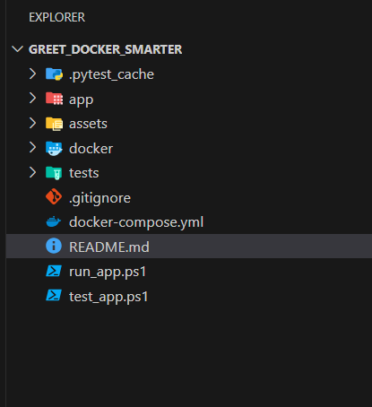
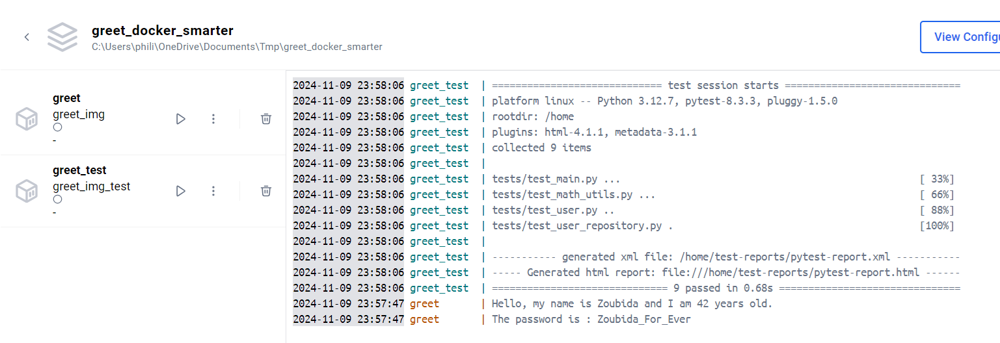
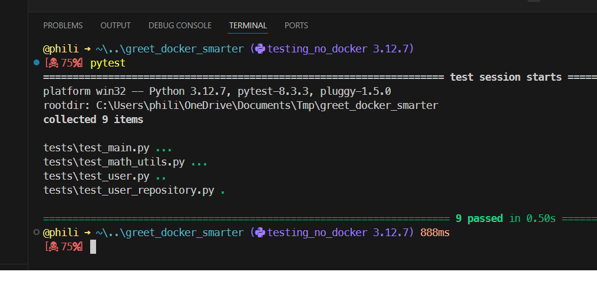
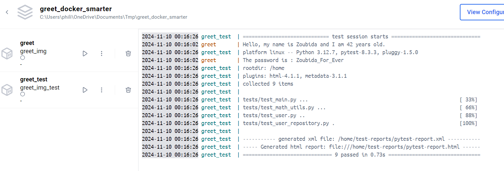
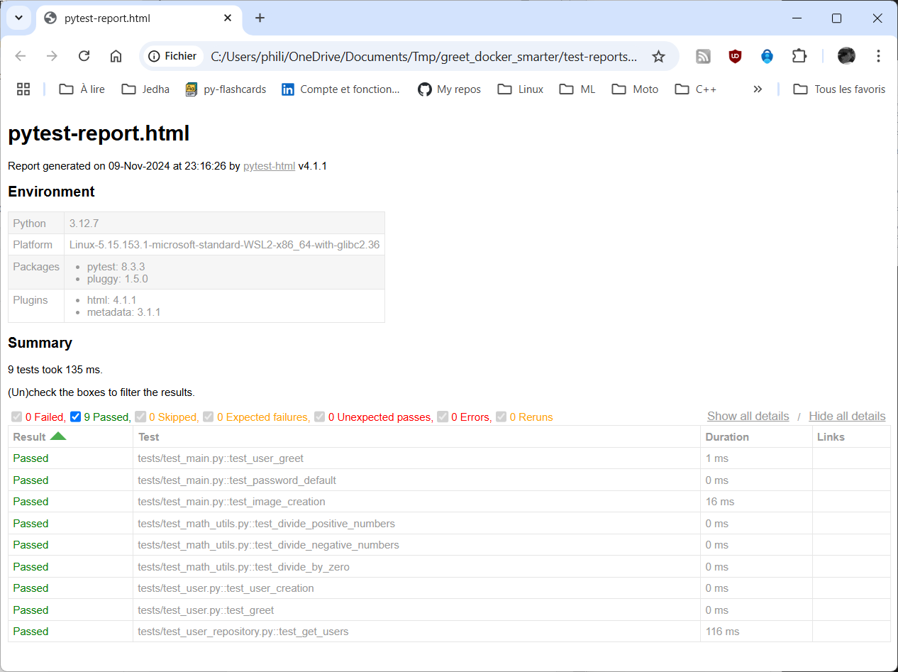

<!-- 
# remove all containers
docker rm -f $(docker ps -aq)
# remove image according the pattern 
docker rmi $(docker images -q "greet_img*")
-->

# Intro

- C'est juste pour faire des tests avec Jenkins
- Je veux lancer les test à chaque fois que je fais un push
- Jenkins tourne en local dans une image Docker

# Setup

Je fais une copie d'un autre répertoire où j'avais fais des tests de tests dansdes images Docker et où j'avais passé pas mal de temps à minimiser les fichiers requirements, Dockerfile... à maintenir. Si besoin lire ce [README.md](https://github.com/40tude/fraud_detection_2/blob/main/99_tooling/20_testing/README.md)

Je fais une copie de `C:\Users\phili\OneDrive\Documents\Programmation\fraud_detection_2\99_tooling\20_testing\05_greet_docker_smarter`

Dans ``C:\Users\phili\OneDrive\Documents\Tmp\greet_docker_smarter``

J'ouvre un terminal dans ce dossier

Je suis en environnement conda base

code .

J'ajoute un .gitignore

Je fais le menage dans ``./assets`` et je supprime ``./img`` (sera recrée si besoin)

<p align="center">

<p>

Je vérifie qu'il n'y a aucune image `greet_img` ou `greet_img_test` dans docker

J'ouvre un terminal à la racine du projet

```powershell
./run_app.ps1
./test_app.ps1
```
Tout fonctionne

<p align="center">

<p>

Je quitte VSCode

Je switch en environnement `testing_no_docker` (où pytest est dispo)

```powershell
conda activate testing_no_docker
code .
```

J'ouvre un terminal à la racine du projet

```powershell
pytest
```

Tout fonctionne

<p align="center">

<p>


Je quitte VSCode

Je switch de nouveau en environnement `base`


```powershell
conda deactivate
code .
```

Je fais un commit du projet sur github


# Vérification avant Jenkins 

Supprimer si besoin les containers et images utilisés avec "greet" préalablement 

```powershell
docker rm -f $(docker ps -aq)
docker rmi $(docker images -q "greet_img*")
```

Lancer Jenkins
```powershell
cd C:\Users\phili\OneDrive\Documents\Programmation\Formations_JEDHA\04_Data_Science_Lead2_oct_2024\07_MLOps\02_CICD\sample-jenkins-server
docker-compose up
```
Aller sur http://localhost:8080/


## Lancer l'application est les test dans des images

Ouvrir un terminal à la racine du projet

```powershell
./run_app.ps1
./test_app.ps1
```
Tout fonctionne
* Une image est générée dans ./img
* Un rapport est généré en 2 versions dans ``./test_reports``


Pour le rapport 
1. J'utilise Docker desktop
1. J'ouvre ./test-reports/pytest-report.htm avec un browser

<p align="center">

<p>


<p align="center">

<p>


# Jenkins
New job
pipeline
Un vrai clickodrome...