<!-- 
# remove all containers
docker rm -f $(docker ps -aq)
# remove image according the pattern 
docker rmi $(docker images -q "greet_img*")
-->

<!-- 
docker ps -a -q --filter "name=greet*" | ForEach-Object { docker rm $_ }
docker image ls --format "{{.Repository}}:{{.ID}}" | Select-String "^greet" | ForEach-Object { $id = ($_ -replace '.*:', ''); docker rmi -f $id }
 -->


<!-- ###################################################################### -->
<!-- ###################################################################### -->
# Intro

- C'est juste pour faire des tests avec Jenkins
- A la fin je veux lancer les tests à chaque fois que je fais un push sur GitHub
- Jenkins tourne en local dans une image Docker
- Les premiers tests montrent que c'est la misère (webhook, github doit appeler jenkins sur mon pc...)
- On va commencer par faire un lancement des tests si y a des changements sur Github en demandant d'aller vérifier toutes les 5 minutes 


<!-- ###################################################################### -->
<!-- ###################################################################### -->
# Setup

Je fais une copie d'un autre répertoire où j'avais fait des tests de testing dans des images Docker.
J'avais passé pas mal de temps à minimiser les fichiers requirements, Dockerfile... à maintenir. 
Si besoin lire ce [README.md](https://github.com/40tude/fraud_detection_2/blob/main/99_tooling/20_testing/README.md)

Je fais donc une copie de `C:\Users\phili\OneDrive\Documents\Programmation\fraud_detection_2\99_tooling\20_testing\05_greet_docker_smarter`
Dans ``C:\Users\phili\OneDrive\Documents\Tmp\greet_docker_smarter``

J'ouvre un terminal dans ce dossier
Je suis en environnement conda ``base``

code .

J'ajoute un .gitignore

Je fais le menage dans ``./assets`` et je supprime ``./img`` (sera recrée si besoin)

<p align="center">

<p>

Je vérifie qu'il n'y a aucune image `greet_img` ou `greet_img_test` dans docker

J'ouvre un terminal à la racine du projet

```powershell
./run_app.ps1
./test_app.ps1
```
Tout fonctionne

<p align="center">

<p>

Je quitte VSCode

Je switch en environnement `testing_no_docker` (où pytest est dispo)

```powershell
conda activate testing_no_docker
code .
```

J'ouvre un terminal à la racine du projet

```powershell
pytest
```

Tout fonctionne

<p align="center">

<p>


Je switch de nouveau en environnement `base` et je relance VSCode


```powershell
conda deactivate
code .
```

Je fais un commit du projet sur github


<!-- ###################################################################### -->
<!-- ###################################################################### -->
# Préparation avant Jenkins
* Je ne vais pas pas pouvoir garder les ``secrets.ps1`` car quand Jenkins va vouloir faire quoi que ce soit, il le fera dans un contexte Linux
* Impossible pour lui de lancer `run_app.ps1` ni ``./secrets.ps1`` 

```powershell
# run_app.ps1

. "./app/secrets.ps1"
docker-compose up greet -d 
```

* Je vais 
    * utiliser les ``.env`` qui sont reconnus par docker-compose 
    * revérifier que tout fonctionne bien une seconde fois

## Installer les ``.env``

* Renommer ``./app/secrets.ps1`` en ``./app/secrets.ps1.bak``
* Ajouter ``.env`` à ``.gitignore``
* Ecrire le ``./app/.env`` correspndant à ``./app/secrets.ps1``


```powershell
# .env
PASSWORD=Zoubida_For_Ever
```

* Modifier `run_app.ps1` et `test_app.ps1`
    * Oui, oui je sais on pourra plus l'utilisé sous Jenkins mais pour l'instant il permet de tester la ligne de command qu'il faudra utiliser 
    * Exemple avec `run_app.ps1`


```powershell
# run_app.ps1

# . "./app/secrets.ps1"
# docker-compose up greet -d 

docker-compose --env-file ./app/.env up greet -d 
```

Avant d'essayer de lancer les containers, supprimer les containers et images utilisés avec "greet" préalablement 


```powershell
./clean_greet.ps1
```

Ensuite 


```powershell
./run_app.ps1
./test_app.ps1
```


Tout fonctionne

<p align="center">
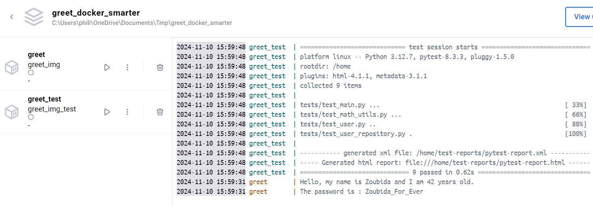
<p>


* Une image est générée dans ./img
* Un rapport est généré en 2 versions dans ``./test_reports``
    * Pour le rapport j'ouvre ``./test-reports/pytest-report.htm`` avec un browser


<p align="center">

<p>


<!-- ###################################################################### -->
<!-- ###################################################################### -->
# Vérification avant Jenkins 


Lancer Jenkins. Dans mon cas je fais : 

```powershell
cd C:\Users\phili\OneDrive\Documents\Programmation\Formations_JEDHA\04_Data_Science_Lead2_oct_2024\07_MLOps\02_CICD\sample-jenkins-server
docker-compose up
```
Attendre 3H puis aller sur http://localhost:8080/


<p align="center">
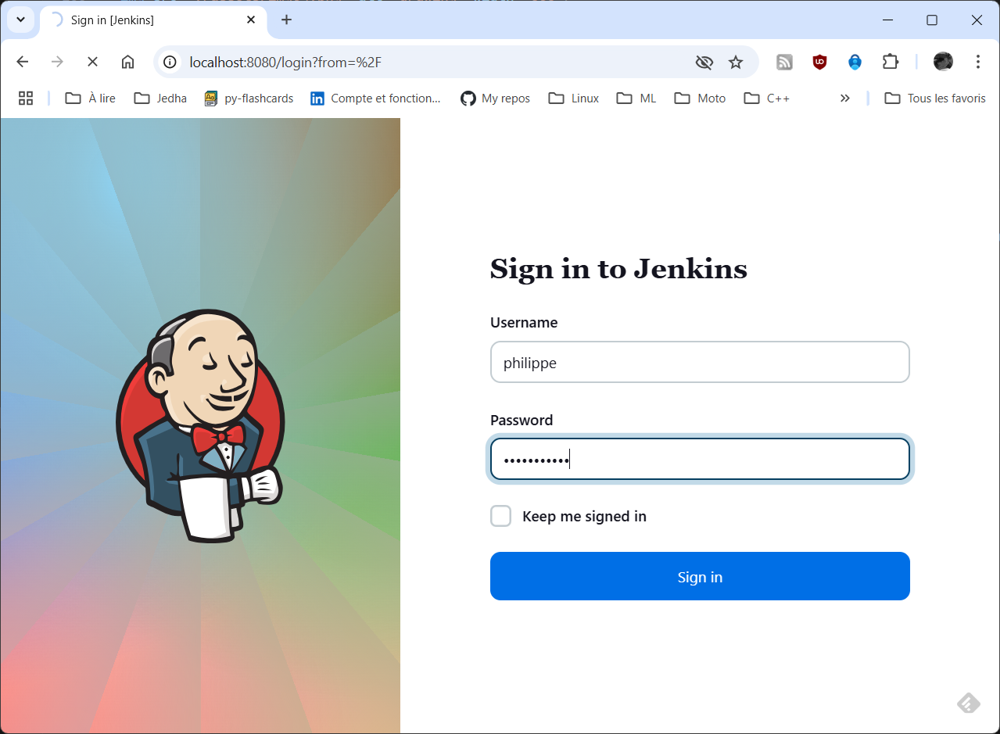
<p>


Create a job

<p align="center">
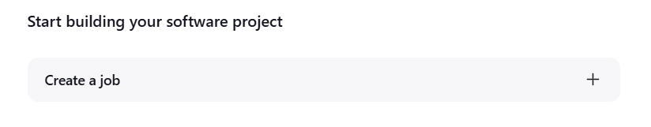
<p>


Freestyle project

<p align="center">
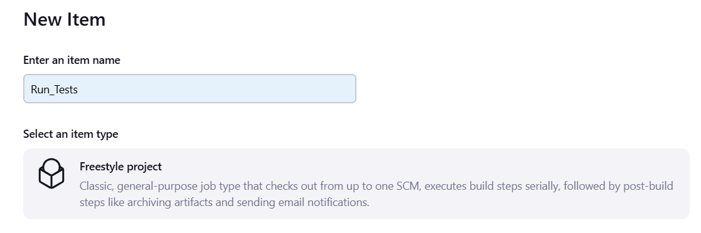
<p>


Select Source Code Management

<p align="center">
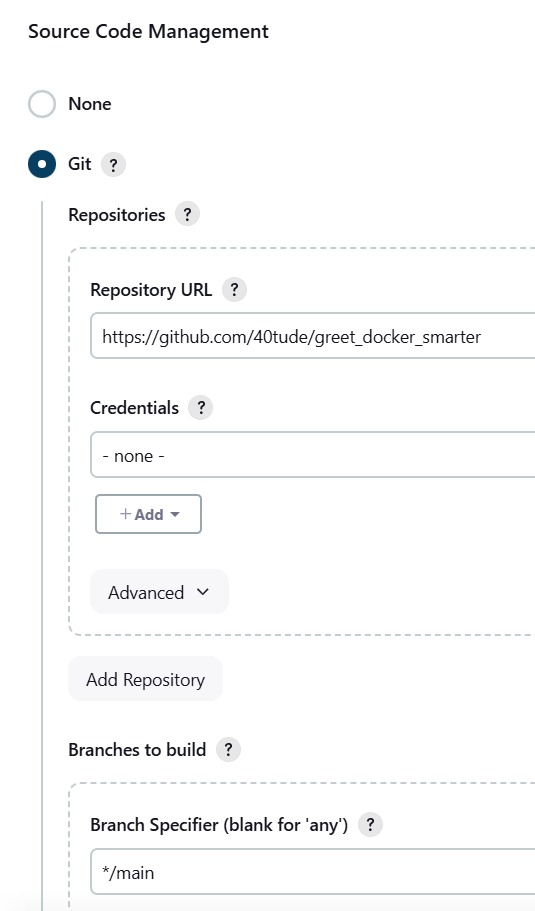
<p>


Build Triggers

<p align="center">
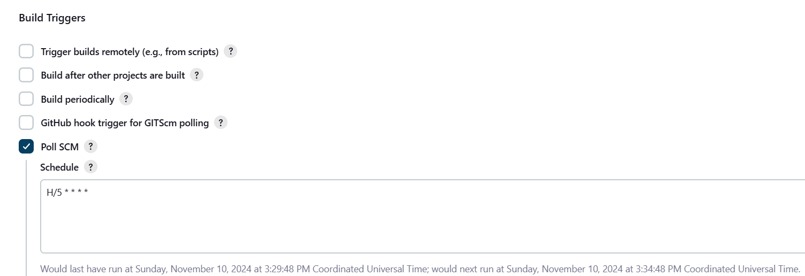
<p>


Add a Build Step

* Copy the line from test_app.ps1 

``` batch
docker-compose --env-file ./app/.env up greet_test -d
```

<p align="center">
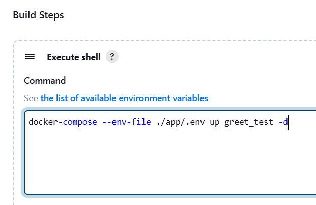
<p>

* Save 
* Build Now
* Et là ça part en vrille...


<!-- ###################################################################### -->
<!-- ###################################################################### -->
# docker-compose est pas dispo sur l'image Jedha !!!!

* docker-compose pas dispo sur l'image de Jedha
* La preuve

``` batch
docker exec -it jenkins-blueocean /bin/bash
```

* Puis

``` batch
docker-compose --version
``` 

* Alors 

``` batch
jenkins@7aaa0d44c7af:/$ docker-compose --version
bash: docker-compose: command not found
``` 


Aller dans `C:\Users\phili\OneDrive\Documents\Programmation\Formations_JEDHA\04_Data_Science_Lead2_oct_2024\07_MLOps\02_CICD\sample-jenkins-server`
* Ouvrir Dockerfile
* Sous la ligne

``` batch
RUN apt-get update && apt-get install -y docker-ce-cli
``` 

* Rajouter la ligne 

``` batch
RUN curl -L "https://github.com/docker/compose/releases/download/$(curl -s https://api.github.com/repos/docker/compose/releases/latest | grep -Po '"tag_name": "\K.*?(?=")')/docker-compose-$(uname -s)-$(uname -m)" -o /usr/local/bin/docker-compose \
    && chmod +x /usr/local/bin/docker-compose
``` 

```dockerfile
# Dockerfile
FROM jenkins/jenkins:2.462.1-jdk17
USER root
RUN apt-get update && apt-get install -y lsb-release
RUN curl -fsSLo /usr/share/keyrings/docker-archive-keyring.asc \
  https://download.docker.com/linux/debian/gpg
RUN echo "deb [arch=$(dpkg --print-architecture) \
  signed-by=/usr/share/keyrings/docker-archive-keyring.asc] \
  https://download.docker.com/linux/debian \
  $(lsb_release -cs) stable" > /etc/apt/sources.list.d/docker.list
RUN apt-get update && apt-get install -y docker-ce-cli
RUN curl -L "https://github.com/docker/compose/releases/download/$(curl -s https://api.github.com/repos/docker/compose/releases/latest | grep -Po '"tag_name": "\K.*?(?=")')/docker-compose-$(uname -s)-$(uname -m)" -o /usr/local/bin/docker-compose \
    && chmod +x /usr/local/bin/docker-compose
USER jenkins
RUN jenkins-plugin-cli --plugins "blueocean docker-workflow"
``` 


* Modifier docker-compose.yml car :
    * pas de build
    * pas de nom

```yaml
# docker-compose.yml
services:
  jenkins-docker:
    image: docker:dind
    container_name: jenkins-docker
    privileged: true
    networks:
      jenkins:
        aliases:
          - docker
    environment:
      DOCKER_TLS_CERTDIR: "/certs"
    volumes:
      - jenkins-docker-certs:/certs/client
      - jenkins-data:/var/jenkins_home
    ports:
      - "2376:2376"
    command: --storage-driver overlay2
    restart: always

  jenkins-blueocean:
    build: .                            # Construire à partir du Dockerfile présent dans le répertoire courant
    image: jedha/sample-jenkins-server  # donner un nom
    container_name: jenkins-blueocean
    networks:
      - jenkins
    environment:
      DOCKER_HOST: "tcp://docker:2376"
      DOCKER_CERT_PATH: "/certs/client"
      DOCKER_TLS_VERIFY: "1"
    volumes:
      - jenkins-data:/var/jenkins_home
      - jenkins-docker-certs:/certs/client:ro
    ports:
      - "8080:8080"
      - "50000:50000"
    restart: on-failure

networks:
  jenkins:

volumes:
  jenkins-docker-certs:
  jenkins-data:

```


* Reconstruire l'image

``` batch
docker-compose build
``` 

* Relancer le serveur Jenkins

``` batch
docker-compose up -d
``` 

<!-- ###################################################################### -->
## Verifier que docker-compose est bien installé sur le serveur Jenkins 


``` batch
docker exec -it jenkins-blueocean /bin/bash
```

* Puis

``` batch
docker-compose --version
``` 

* Alors 


<p align="center">
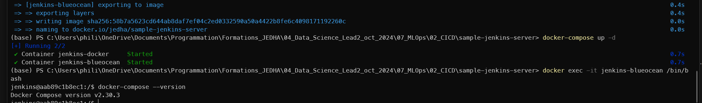
<p>


<!-- ###################################################################### -->
<!-- ###################################################################### -->
# Relancer les test

* Aller sur `http://localhost:8080/`
* Se connecter
* Choisir ``Run_Tests``
* Build Now
* Et là ça marche toujours pas
    * En fait à l'execution il ne trouve pas le .env
    * Forcément il n'est pas sur Github


<p align="center">
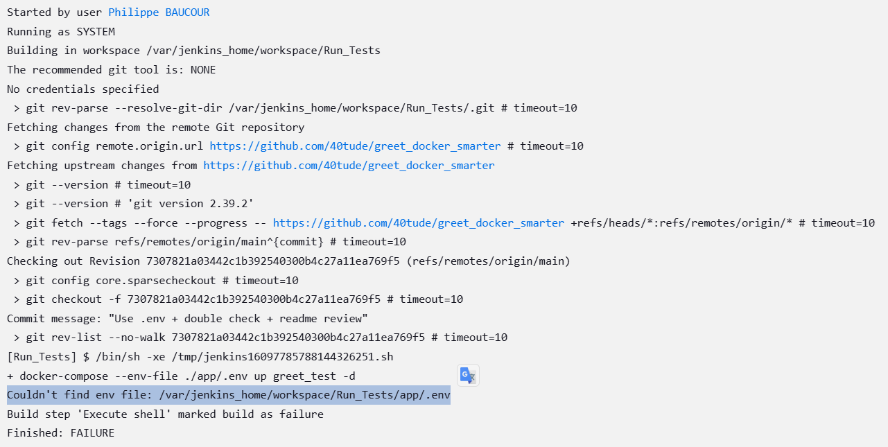
<p>

* Il faut trouver un moyen de passer le ``.env``, après le téléchargement de GitHub mais avant le ``docker-compose --env-file ./app/.env up greet_test -d``


<!-- ###################################################################### -->
# Relancer les test

## Test quand .env n'est PAS dans .gitignore
* Ca passe
* Je ne comprends pas les sorties

<p align="center">
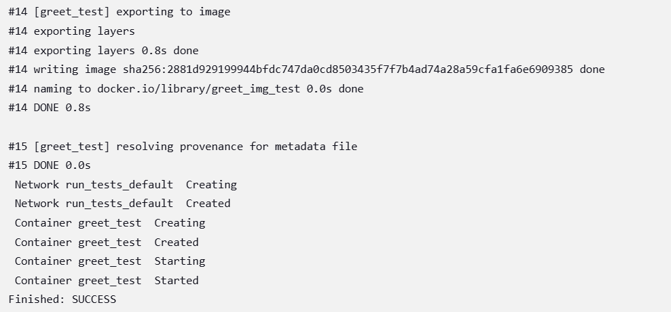
<p>

* A priori le rapport a été généré correctement

``` batch
docker exec -it jenkins-blueocean /bin/bash
cd /var/jenkins_home/workspace/Run_Tests
date
ls -al
```


<p align="center">
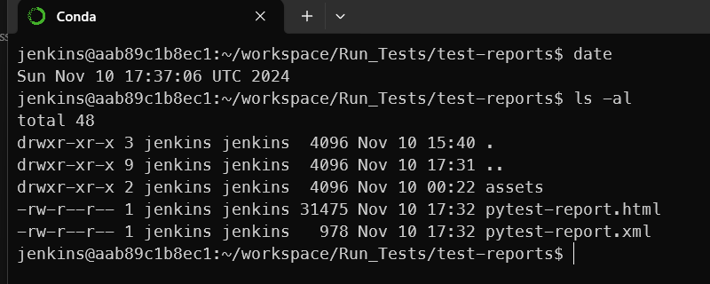
<p>


<!-- ###################################################################### -->
<!-- ###################################################################### -->
# Passer par un pipeline, un Jenkinsfile et ???


<!-- ###################################################################### -->
## Test minimal (.env encore sur GitHub)

* Créer un projet `run_tests`
* De type pipeline
* Dans build trigger choisir Poll SCM, Schedule = `H/5 * * * *`
* Dans Pipeline/Definition/Pipeline Script copier le code ci-dessous :

```groovy
pipeline {
    agent any
    stages {
        stage('Checkout') {
            steps {
                git branch: 'main', url: 'https://github.com/40tude/greet_docker_smarter'
            }
        }
        
        stage('Test') {
            steps {
                sh 'docker-compose --env-file ./app/.env up greet_test -d'
            }
        }
    }
}
```
* Save
* Build Now
* Aller voir le contenu de la console
    * Faut cliquer d'abord sur le ``#2`` (par exemple) en bas dans ``Build History``


<p align="center">
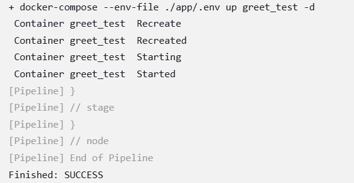
<p>

* Ouvrir un terminal, se brancher sur Jenkins
    * Attnetion ici c'est ``run_tests`` (vs ``Run_Tests`` au coup d'avant)

``` batch
docker exec -it jenkins-blueocean /bin/bash
cd /var/jenkins_home/workspace/run_tests
date
ls -al
```

<p align="center">
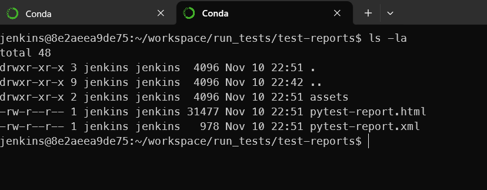
<p>


<!-- ###################################################################### -->
## Test minimal (.env plus sur GitHub)

* Normalement on doit avoir un souci avec PASSWORD
* ajouter ``.env`` dans ``.gitignore``
* Sauver tout et faire un push sur GitHub
* Faut peut être aller faire un tour sur GitHub et, si besaoin, supprimer le ``./app/.env`` à la main
* Mettre à jour le script groovy
    * On a plus le `--env-file ./app/.env` sur la ligne `docker-compose`

```groovy
pipeline {
    agent any
    stages {
        stage('Checkout') {
            steps {
                git branch: 'main', url: 'https://github.com/40tude/greet_docker_smarter'
            }
        }
        
        stage('Test') {
            steps {
                sh 'docker-compose up greet_test -d'
            }
        }
    }
}
```
* Save
* Build Now
* Aller voir le contenu de la console
    * Faut cliquer d'abord sur le ``#N`` en bas dans ``Build History``
* Ici on voit bien dans les log que PASSWORD n'est pas défini

<p align="center">
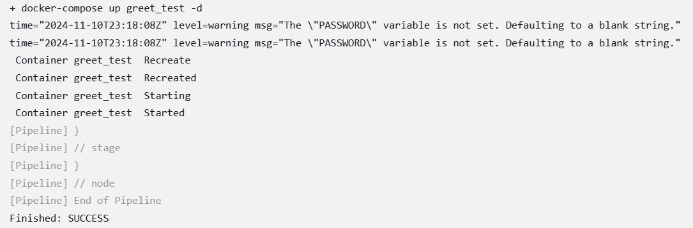
<p>


<!-- ###################################################################### -->
## Comment passer le .env ?

* On va commencer par passer uniquement la variable PASSWORD
* On utilise les Jenkins credentials

Manage Jenkins/Credentials

<p align="center">
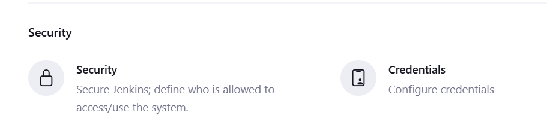
<p>


Credential/System

<p align="center">
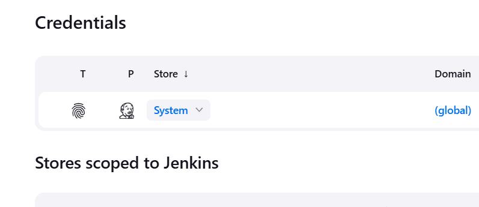
<p>


Global Credentials

<p align="center">
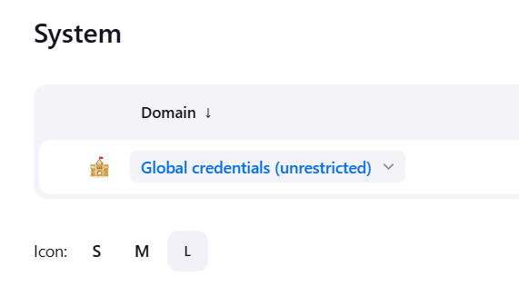
<p>

Add Credential

<p align="center">
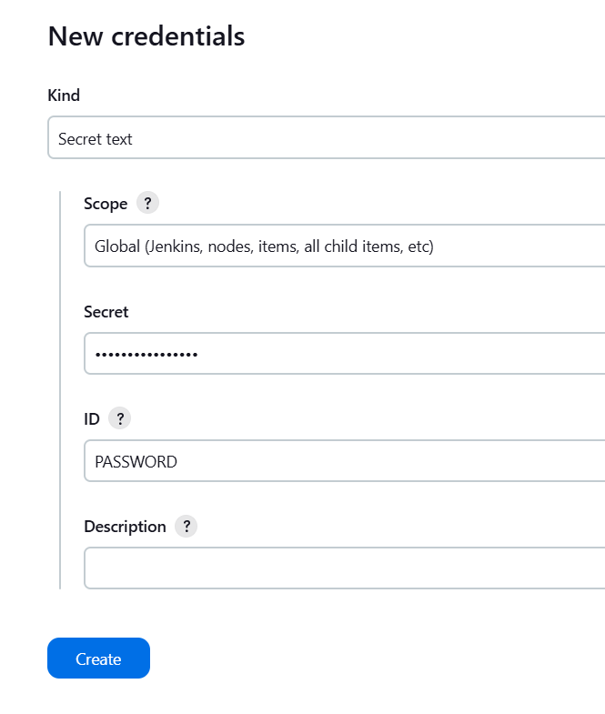
<p>

Create

Modifier le script

```groovy
pipeline {
    agent any
    environment { PASSWORD = credentials('PASSWORD') }
    stages {
        stage('Checkout') {
            steps {
                git branch: 'main', url: 'https://github.com/40tude/greet_docker_smarter'
            }
        }
        
        stage('Test') {
            steps {
                sh 'docker-compose up greet_test -d'
            }
        }
    }
}
```

* Save
* Build Now
* Aller voir le contenu de la console
    * Faut cliquer d'abord sur le ``#N`` en bas dans ``Build History``
Pas de problème de variable d'environnement PASSWORD non définie 

<p align="center">
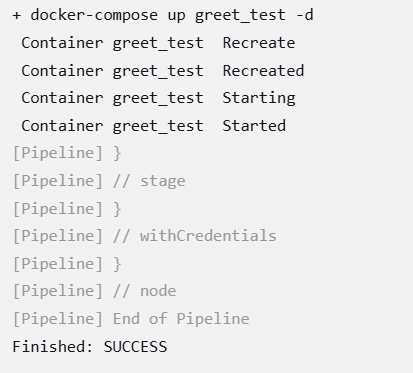
<p>

Le rapport a bien été généré

<p align="center">
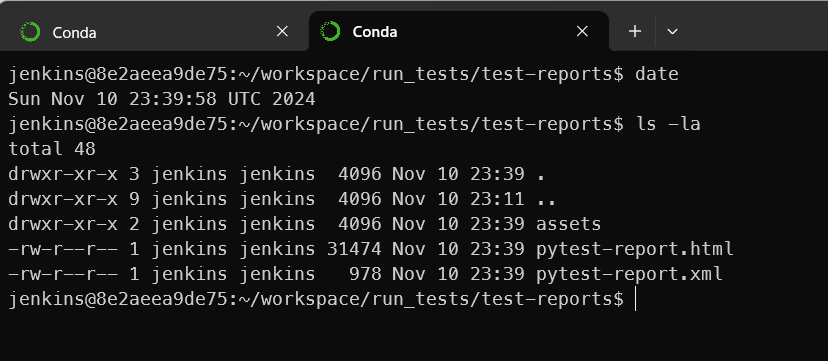
<p>


<!-- ###################################################################### -->
## Création d'un fichier .env via le script

* Supprimer le précédent crential

<p align="center">
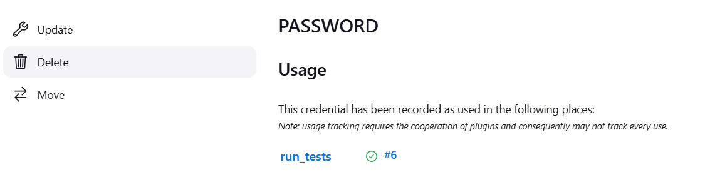
<p>

* **ATTENTION DANGER**
    * Ajouter ``Jenkinsfile`` à ``.gitignore``
    * Je suis obligé de faire ça car en fait les scripts que je copie/colle dans ce ``README.md`` provienne de ce fichier
    * Pour l'instant il n'y a rien de critique mais demains on aura des choses plus sensibles 

Modifier le script
1. Voir comment on construit à la volée le fichier ./app/env
    * Oui il faudra écrire ici les mots de passe en clair (on le faisait déjà dans ``secrets.ps1`` et ``.env``)
1. Bien voir aussi qu'on remet l'option `--env-file ./app/.env` sur la ligne ``docker-compose``
1. Noter aussi qu'on a plus la ligne `environment { PASSWORD = credentials('PASSWORD') }`

```groovy
pipeline {
    agent any
    stages {
        stage('Generate .env') {
            steps {
                script {
                    // Créer .env dans le répertoire ./app
                    writeFile file: 'app/.env', text: """
                    PASSWORD=Zoubida_For_Ever
                    EXAMPLE_VAR2="Avec espaces"
                    """
                }
            }
        }

        stage('Checkout') {
            steps {
                git branch: 'main', url: 'https://github.com/40tude/greet_docker_smarter'
            }
        }
        
        stage('Test') {
            steps {
                sh 'docker-compose --env-file ./app/.env up greet_test -d'
            }
        }
    }
}
```
* Save
* Build Now
* Aller voir le contenu de la console
    * Faut cliquer d'abord sur le ``#N`` en bas dans ``Build History``

*Pas de problème de variable d'environnement PASSWORD non définie 

<p align="center">
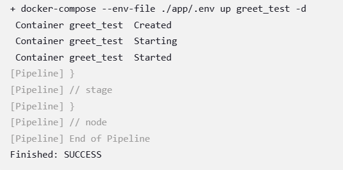
<p>

Le rapport a bien été généré

<p align="center">
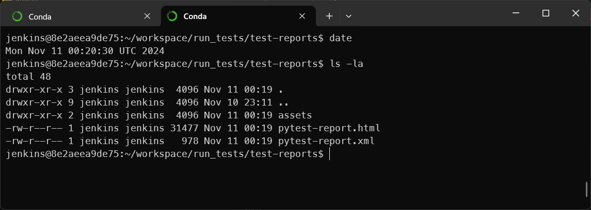
<p>


<!-- ###################################################################### -->
<!-- ###################################################################### -->
# Conclusion partielle


<!-- ###################################################################### -->
## Si on fait un point rapide...
* On a un projet
* Qui tourne en local dans une image docker lancée par docker-compose (``./run_app.ps1``)
* On peut lancer une serie de tests qui se déroulent dans une image docker lancée par docker-compose (``./test_app.ps1``)
* À partir de maintenant
    * Toute les 5 minutes le repo Github est surveillé
    * Si il y a eu des chagements
    * Le projet est rapatrié sur la machine Jenkins et la batteries de test s'y déroule
        * Rest 1 ou 2 détails à fixer (voir plus bas)

<!-- ###################################################################### -->
## D'un point de vue pratique 

* On peut supprimer ``./app/secrets.ps1``
    * On le quand même garde dans ``.gitignore`` (on sait jamais) 
* On ne garde plus que `./app/.env`
    * Il est dans ``.gitignore``
* Quand on est en local on utilise
    * ``run_app.ps1``
    * ``test_app.ps1``
    * Ils utilisent ``./app/.env``
* On ajoute ``Jenkinsfile`` à ``.gitignore``
    * Sur Jenkins on fait des Pipeline (pas des Freestyle project)
    * Dans le script on crée à la volée le ``./app/.env``


<!-- ###################################################################### -->
## C'est peut être un détail pour vous
1. Tu te rappelle FG, 1980 ?
1. Il faut être sûr que le script démarre bien toutes les 5 minutes si y a eu des changements dans le projet depuis le dernier run de tests
1. Comment faire pour récupérer sur l'hôte Windows 11 le rapport de test qui est généré dans `:~/workspace/run_tests/test-reports$`
    * Faut récupérer les 2 fichiers et un répertoire `assets`


### L'exécution automatique fonctionne 
Je fais un 
<p align="center">
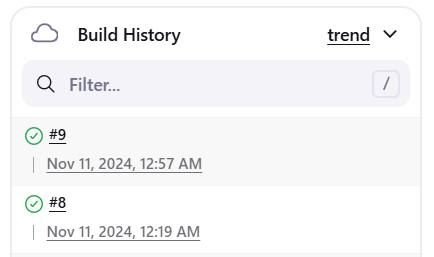
<p>

<p align="center">
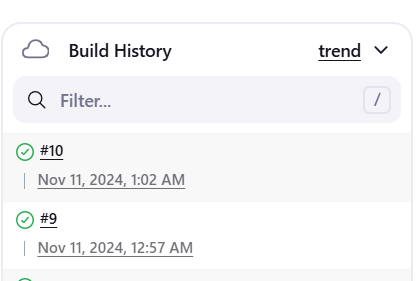
<p>


