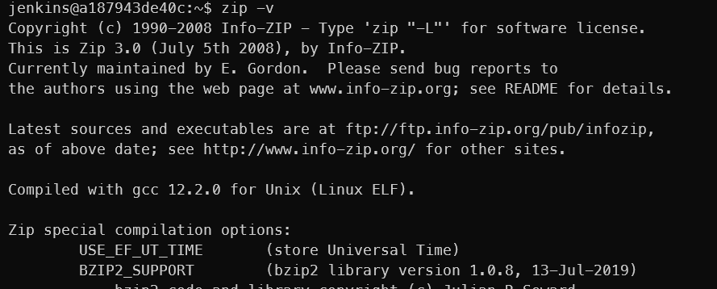
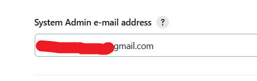

<!-- 
# remove all containers
docker rm -f $(docker ps -aq)
# remove image according the pattern 
docker rmi $(docker images -q "greet_img*")
-->

<!-- 
docker ps -a -q --filter "name=greet*" | ForEach-Object { docker rm $_ }
docker image ls --format "{{.Repository}}:{{.ID}}" | Select-String "^greet" | ForEach-Object { $id = ($_ -replace '.*:', ''); docker rmi -f $id }
 -->


<!-- 
# Lancer Jenkins
cd C:\Users\phili\OneDrive\Documents\Programmation\Formations_JEDHA\04_Data_Science_Lead2_oct_2024\07_MLOps\02_CICD\sample-jenkins-server
docker-compose up

-->

<!-- 
Se connecter à Jenkins
docker exec -it jenkins-blueocean /bin/bash
cd /var/jenkins_home/workspace/

 -->


<!-- 

```powershell
``` 
-->


<!-- ###################################################################### -->
<!-- ###################################################################### -->
# Introduction

- C'est juste pour faire des tests avec Jenkins
- L'objectif, c'est de lancer automatiquement des tests à chaque fois que je fais un push sur GitHub
- Jenkins tourne en local dans une image Docker
- Les premiers tests montrent que c'est un peu la misère
    * webhook, 
    * github qui doit appeler jenkins sur mon pc...
- Je vais donc commencer par faire un lancement des tests si il y a des changements sur Github en demandant à Jenkins d'aller vérifier toutes les 5 minutes 


<!-- ###################################################################### -->
<!-- ###################################################################### -->
# Checklist avant décollage

* Je copie un répertoire où j'ai déjà fait des essais de testing dans des images Docker.
* J'ai passé pas mal de temps à optimiser le setup, l'organisation et à minimiser le nombre de fichiers à maintenir : fichiers requirements, Dockerfile... 
* Les tests et l'exécution du code se font dans des images Docker lancées par un unique docker-compose 
* Si besoin lire ce [README.md](https://github.com/40tude/fraud_detection_2/blob/main/99_tooling/20_testing/README.md)
* Je fais donc une copie de `C:\Users\phili\OneDrive\Documents\Programmation\fraud_detection_2\99_tooling\20_testing\05_greet_docker_smarter`
* Dans ``C:\Users\phili\OneDrive\Documents\Tmp\greet_docker_smarter``
* J'ouvre un terminal dans ce dossier
* Je suis en environnement conda ``base`` dans lequel, par exemple, ``pytest`` n'est pas disponible. 

```powershell
code .
```

* J'ajoute un ``.gitignore``
* Je fais le menage dans ``./assets`` et je supprime ``./img`` (il sera recréé si besoin)

<p align="center">

<p>

* Je vérifie qu'il n'y a aucune image `greet_img` ou `greet_img_test` dans Docker
* Dans VSCode, j'ouvre un terminal à la racine du projet

```powershell
./run_app.ps1
./test_app.ps1
```
* Tout fonctionne. Ci-dessous ce que je peux lire dans Docker Desktop
    * L'application ``greet`` dit bonjour
    * Puis les tests (`greet_test`) se déroulent. 9 tests sont collectés et sont appliqués sur 4 fichiers Python

<p align="center">

<p>

* Je quitte VSCode
* Je passe en environnement virtuel conda `testing_no_docker` (où pytest est dispo)
* En fait je veux m'assurer que les tests peuvent se dérouler aussi en local (pas uniquement dans une image Docker) 

```powershell
conda activate testing_no_docker
code .
```

* Dans VSCode, j'ouvre un terminal à la racine du projet

```powershell
pytest
```

* Tout fonctionne aussi quand, au lieu de créer des images Docker pour y faire tourner l'application ou dérouler des tests, je lance l'application ou les tests directement en local

<p align="center">

<p>


* Je quitte VSCode, je repasse en environnement `base` et je relance VSCode


```powershell
conda deactivate
code .
```

* J'ai vérifié que tout fonctionne, je peux faire un commit du projet sur github


<!-- ###################################################################### -->
<!-- ###################################################################### -->
# Préparation avant l'utilisation dans un contexte Jenkins

* Je ne vais pas pas pouvoir garder les fichiers ``secrets.ps1`` car, quand Jenkins va vouloir faire quoi que ce soit, il le fera dans un contexte "Linux"
* Impossible pour lui de lancer `run_app.ps1` ni de lire ``./secrets.ps1`` 
    * Pour rappel, `run_app.ps1` est le script utilisé pour lancer l'application
    * En appelant `secrets.ps1`, il s'assure que les mots de passe et/ou les paramètres que l'on veut passer à l'application sont bien définies comme des variables d'environnement 
    * Ensuite il invoque docker-compose 

```powershell
# run_app.ps1

. "./app/secrets.ps1"
docker-compose up greet -d 
```

* Je décide
    * d'utiliser des fichiers ``.env`` qui sont reconnus par docker-compose 
    * de vérifier que tout fonctionne bien une seconde fois

## Installer les ``.env``

* Renommer ``./app/secrets.ps1`` en ``./app/secrets.ps1.bak``
* Ajouter ``.env`` à ``.gitignore``
* Ecrire le ``./app/.env`` correspondant à ``./app/secrets.ps1``


```powershell
# .env
PASSWORD=Zoubida_For_Ever
```

* Modifier `run_app.ps1` et `test_app.ps1`
    * Oui, oui je sais on pourra plus les utiliser sous Jenkins mais, tant qu'on est sur l'hôte Windows ils restent utile
        * Permettent de tester la ligne de commande qu'il faudra utiliser plus tard sous Jenkins
        * Permettent, sur l'hôte, de continuer à lancer l'application ou les tests "comme on a l'habitude de le faire" 
    * Exemple des modifications à faire dans `run_app.ps1`


```powershell
# run_app.ps1

# . "./app/secrets.ps1"
# docker-compose up greet -d 

docker-compose --env-file ./app/.env up greet -d 
```

* Avant d'essayer de lancer les containers, je supprime les containers et images utilisés préalablement 


```powershell
./clean_greet.ps1
```

* Si besoin le code du script : 

```powershell
# clean_greet

docker ps -a -q --filter "name=greet*" | ForEach-Object { docker rm $_ }
docker image ls --format "{{.Repository}}:{{.ID}}" | Select-String "^greet" | ForEach-Object { $id = ($_ -replace '.*:', ''); docker rmi -f $id }

```


* Ensuite je lance l'application et les tests : 


```powershell
./run_app.ps1
./test_app.ps1
```


* Tout fonctionne comme avant, je suis rassuré

<p align="center">

<p>


* On voit
    * Une image est générée dans ./img
    * Un rapport est généré en 2 versions dans ``./test_reports``
        * Pour le rapport j'ouvre ``./test-reports/pytest-report.htm`` avec un browser


<p align="center">

<p>


<!-- ###################################################################### -->
<!-- ###################################################################### -->
# Premier job Jenkins 


* Lancer Jenkins. 
* Dans mon cas je fais : 

```powershell
cd C:\Users\phili\OneDrive\Documents\Programmation\Formations_JEDHA\04_Data_Science_Lead2_oct_2024\07_MLOps\02_CICD\sample-jenkins-server
docker-compose up
```
* Attendre 3H puis aller sur http://localhost:8080/ avec un browser


<p align="center">

<p>


* Cliquer sur ``Create a job``

<p align="center">

<p>


* Freestyle project

<p align="center">

<p>


* Select Source Code Management

<p align="center">

<p>


* Build Triggers

<p align="center">

<p>


* Ajouter un ``Build Step`` et y copier la ligne de ``test_app.ps1`` 

``` batch
docker-compose --env-file ./app/.env up greet_test -d
```

<p align="center">

<p>

* Cliquer sur ``Save`` 
* Cliquer sur ``Build Now``
* Et là... Ca part en vrille...


<!-- ###################################################################### -->
<!-- ###################################################################### -->
# docker-compose n'est pas dispo sur l'image Jenkins de Jedha

* docker-compose n'est pas dispo sur l'image Jenkins que partage Jedha
* La preuve, si on se connecte

``` batch
docker exec -it jenkins-blueocean /bin/bash
```

* Et si on vérifie la version

``` batch
docker-compose --version
``` 

* Alors on a un souci

``` batch
jenkins@7aaa0d44c7af:/$ docker-compose --version
bash: docker-compose: command not found
``` 

* Faut arrêter Jenkins. Pour ça, CTRL+C dans le terminal où on la lancé.
* Ensuite, on a pas d'autre solution que de reconstruire l'image et d'y inclure docker-compose
* Aller dans `C:\Users\phili\OneDrive\Documents\Programmation\Formations_JEDHA\04_Data_Science_Lead2_oct_2024\07_MLOps\02_CICD\sample-jenkins-server`
* Ouvrir Dockerfile
* Sous la ligne

``` batch
RUN apt-get update && apt-get install -y docker-ce-cli
``` 

* Rajouter la ligne 

``` batch
RUN curl -L "https://github.com/docker/compose/releases/download/$(curl -s https://api.github.com/repos/docker/compose/releases/latest | grep -Po '"tag_name": "\K.*?(?=")')/docker-compose-$(uname -s)-$(uname -m)" -o /usr/local/bin/docker-compose \
    && chmod +x /usr/local/bin/docker-compose
``` 

```dockerfile
# Dockerfile
FROM jenkins/jenkins:2.462.1-jdk17
USER root
RUN apt-get update && apt-get install -y lsb-release
RUN curl -fsSLo /usr/share/keyrings/docker-archive-keyring.asc \
  https://download.docker.com/linux/debian/gpg
RUN echo "deb [arch=$(dpkg --print-architecture) \
  signed-by=/usr/share/keyrings/docker-archive-keyring.asc] \
  https://download.docker.com/linux/debian \
  $(lsb_release -cs) stable" > /etc/apt/sources.list.d/docker.list
RUN apt-get update && apt-get install -y docker-ce-cli
RUN curl -L "https://github.com/docker/compose/releases/download/$(curl -s https://api.github.com/repos/docker/compose/releases/latest | grep -Po '"tag_name": "\K.*?(?=")')/docker-compose-$(uname -s)-$(uname -m)" -o /usr/local/bin/docker-compose \
    && chmod +x /usr/local/bin/docker-compose
USER jenkins
RUN jenkins-plugin-cli --plugins "blueocean docker-workflow"
``` 


* Modifier ``docker-compose.yml`` car dans la section `jenkins-blueocean`:
    * il n'y a pas de directive (clé) ``build``
    * il n'y a pas de nom

```yaml
# docker-compose.yml
services:
  jenkins-docker:
    image: docker:dind
    container_name: jenkins-docker
    privileged: true
    networks:
      jenkins:
        aliases:
          - docker
    environment:
      DOCKER_TLS_CERTDIR: "/certs"
    volumes:
      - jenkins-docker-certs:/certs/client
      - jenkins-data:/var/jenkins_home
    ports:
      - "2376:2376"
    command: --storage-driver overlay2
    restart: always

  jenkins-blueocean:
    build: .                            # Construire à partir du Dockerfile du répertoire courant
    image: jedha/sample-jenkins-server  # Donner un nom
    container_name: jenkins-blueocean
    networks:
      - jenkins
    environment:
      DOCKER_HOST: "tcp://docker:2376"
      DOCKER_CERT_PATH: "/certs/client"
      DOCKER_TLS_VERIFY: "1"
    volumes:
      - jenkins-data:/var/jenkins_home
      - jenkins-docker-certs:/certs/client:ro
    ports:
      - "8080:8080"
      - "50000:50000"
    restart: on-failure

networks:
  jenkins:

volumes:
  jenkins-docker-certs:
  jenkins-data:

```


* Reconstruire l'image

``` batch
docker-compose build
``` 

* Relancer le serveur Jenkins

``` batch
docker-compose up
``` 

<!-- ###################################################################### -->
## Verifier le docker-compose du serveur Jenkins 

* Ouvrir un terminal

``` batch
docker exec -it jenkins-blueocean /bin/bash
```

* Puis

``` batch
docker-compose --version
``` 

* Alors


<p align="center">

<p>


<!-- ###################################################################### -->
<!-- ###################################################################### -->
# Relancer les tests

* Aller sur `http://localhost:8080/`
* Se connecter
* Choisir ``Run_Tests``
* Build Now
* Et là ça marche toujours pas
    * En fait à l'execution il ne trouve pas le ``.env``
    * Forcément le ``.env`` n'est pas sur Github donc quand Jenkins rapatrie le projet tous les fichiers et répertoires listés dans `.gitignore` manquent à l'appel


<p align="center">

<p>

* Il faut trouver un moyen de passer le ``.env``, après le téléchargement de GitHub mais avant l'exécution de la ligne de commande ``docker-compose --env-file ./app/.env up greet_test -d``


<!-- ###################################################################### -->
# Relancer les tests...  Encore et toujours...

## Test quand ``.env`` n'est PAS dans .gitignore

* Je modifie le contenu de `.gitignore` et je commente la ligne `.env`
    * On peut le faire car il n'y a rien de critique (pas de mot de passe AWS ou autre)
    * L'idée, c'est de se prouver que si on arrive à transmettre le `.env` de l'hôte au contexte Jenkins on sera capable de dérouler les tests.
* Ca passe
* Je ne comprends pas trop les sorties

<p align="center">

<p>

* Mais bon, à priori le rapport a été généré correctement

``` batch
docker exec -it jenkins-blueocean /bin/bash
cd /var/jenkins_home/workspace/Run_Tests
date
ls -al
```


<p align="center">

<p>


<!-- ###################################################################### -->
<!-- ###################################################################### -->
# Faire un projet de type Pipeline

* On va y aller étape par étape
* On va oublier les projets de type FreeStyle et ...
* Dans un premier temps on va faire un projet de type Pipeline qui fait exactement ce que l'on vient de faire
* Quand ça marchera et qu'on sera rassuré on passera à l'étape suivante


<!-- ###################################################################### -->
## Pipeline avec le fichier ``.env`` visible sur GitHub

* Créer un projet Jenkins `run_tests`
* De type ``Pipeline``
* Dans build trigger choisir ``Poll SCM``, ``Schedule`` = `H/5 * * * *`
* Dans Pipeline/Definition/Pipeline Script copier le code ci-dessous :

```groovy
pipeline {
    agent any
    stages {
        stage('Checkout') {
            steps {
                git branch: 'main', url: 'https://github.com/40tude/greet_docker_smarter'
            }
        }
        
        stage('Test') {
            steps {
                sh 'docker-compose --env-file ./app/.env up greet_test -d'
            }
        }
    }
}
```
* Save
* Build Now
* Aller voir le contenu de la console
    * Faut cliquer d'abord sur le ``#2`` (par exemple) en bas dans ``Build History``


<p align="center">

<p>

* Ouvrir un terminal, se brancher sur Jenkins
    * Attention ici c'est ``run_tests`` (vs ``Run_Tests`` qu'on avait dans le test précédent)

``` batch
docker exec -it jenkins-blueocean /bin/bash
cd /var/jenkins_home/workspace/run_tests
date
ls -al
```

<p align="center">

<p>


<!-- ###################################################################### -->
## Pipeline quand le fichier ``.env`` n'est plus sur GitHub

* Normalement on doit avoir un souci avec ``PASSWORD``
* Ajouter ``.env`` dans ``.gitignore``
* Sauver tout et faire un push sur GitHub
* Faut peut être aller faire un tour sur GitHub et, si besaoin, supprimer le ``./app/.env`` à la main
    * Je sais c'est pas bien...
* Mettre à jour le script groovy
    * Ci-dessous, voir qu'on a plus le `--env-file ./app/.env` sur la ligne `docker-compose` car... Y a plus de fichier ``.env``

```groovy
pipeline {
    agent any
    stages {
        stage('Checkout') {
            steps {
                git branch: 'main', url: 'https://github.com/40tude/greet_docker_smarter'
            }
        }
        
        stage('Test') {
            steps {
                sh 'docker-compose up greet_test -d'
            }
        }
    }
}
```
* Save
* Build Now
* Aller voir le contenu de la console
    * Cliquer sur le ``#N`` en bas dans ``Build History``
* Ici on voit bien dans les logs que ``PASSWORD`` n'est pas défini

<p align="center">

<p>


<!-- ###################################################################### -->
## Comment passer le ``.env`` ?

* On va commencer par passer une variable, la variable ``PASSWORD``
* On utilise les Jenkins credentials

* Choisir Manage Jenkins/Credentials

<p align="center">

<p>


* Credential/System

<p align="center">

<p>


* Global Credentials

<p align="center">

<p>

* Add Credential

<p align="center">

<p>

* Create

* Modifier le script en conséquence

```groovy
pipeline {
    agent any
    environment { PASSWORD = credentials('PASSWORD') }
    stages {
        stage('Checkout') {
            steps {
                git branch: 'main', url: 'https://github.com/40tude/greet_docker_smarter'
            }
        }
        
        stage('Test') {
            steps {
                sh 'docker-compose up greet_test -d'
            }
        }
    }
}
```

* Save
* Build Now
* Aller voir le contenu de la console
* Pas de problème de variable d'environnement ``PASSWORD`` non définie 

<p align="center">

<p>

Le rapport a bien été généré

<p align="center">

<p>

* Ceci dit c'est un peu lourd. C'est peut être possible pour une variable ou un paramètre mais si on a beaucoup cela ne me parraît pas viable.
* Faut trouver une autre solution


<!-- ###################################################################### -->
## Création d'un fichier ``.env`` via le script Jenkins

* Supprimer le précédent credential

<p align="center">

<p>

* **ATTENTION DANGER !**
    * Ajouter ``Jenkinsfile`` à ``.gitignore``
    * Je suis obligé de le faire car pour des raisons pratiques, les scripts que je copie/colle dans ce ``README.md`` proviennent de ce fichier ``Jenkinsfile``
    * Pour l'instant il n'y a rien de critique mais demain on aura des choses certainement beaucoup plus sensibles 

* Modifier le script comme ci-dessous et :
1. Voir comment on construit à la volée le fichier ``./app/env``
    * Oui il faudra écrire ici les mots de passe en clair (on le faisait déjà dans ``secrets.ps1`` puis dans ``.env``)
    * Ne pas oublier que le serveur Jenkins tourne en local et n'est pas accessible de l'extérieur
1. Bien voir aussi qu'on remet l'option `--env-file ./app/.env` sur la ligne ``docker-compose``
1. Noter aussi qu'on a plus la ligne `environment { PASSWORD = credentials('PASSWORD') }`

```groovy
pipeline {
    agent any
    stages {
        stage('Generate .env') {
            steps {
                script {
                    // Créer .env dans le répertoire ./app
                    writeFile file: 'app/.env', text: """
                    PASSWORD=Zoubida_For_Ever
                    EXAMPLE_VAR2="Avec espaces"
                    """
                }
            }
        }

        stage('Checkout') {
            steps {
                git branch: 'main', url: 'https://github.com/40tude/greet_docker_smarter'
            }
        }
        
        stage('Test') {
            steps {
                sh 'docker-compose --env-file ./app/.env up greet_test -d'
            }
        }
    }
}
```
* Save
* Build Now
* Aller voir le contenu de la console
* Pas de problème de variable d'environnement ``PASSWORD`` non définie 

<p align="center">

<p>

* Le rapport a bien été généré

<p align="center">

<p>


<!-- ###################################################################### -->
<!-- ###################################################################### -->
# Conclusion partielle


<!-- ###################################################################### -->
## Si on fait un point rapide...
* On a un projet
* Qui tourne en local dans une instance d'image docker et qui est lancé par docker-compose (``./run_app.ps1``)
* On peut lancer une serie de tests qui se déroulent dans une instance d'une seconde image docker et qui est aussi lancée par docker-compose (``./test_app.ps1``)
* Suite à ce qui a été fait sous Jenkins, à partir de maintenant :
    * Toute les 5 minutes le repo Github est inspecté
    * Si il y a eu des chagements par rapport à la dernière inspection
    * Le projet est rapatrié sur la machine Jenkins et la batteries de test s'y déroule
        * Il reste 1 ou 2 détails à régler (voir plus bas) mais on est pas trop mal

<!-- ###################################################################### -->
## D'un point de vue pratique 

* On peut dorénavnat supprimer le fichier ``./app/secrets.ps1``
    * On garde quand même une entrée `secrets.ps1` dans ``.gitignore`` (on sait jamais) 
* On ne garde plus que `./app/.env`
    * Il est dans ``.gitignore``
* Quand on est en local on continue d'utiliser
    * ``run_app.ps1``
    * ``test_app.ps1``
    * Ils utilisent ``./app/.env``
* On ajoute ``Jenkinsfile`` à ``.gitignore``
    * Sur Jenkins on fait des Pipeline (pas des Freestyle project)
    * Dans le script on crée à la volée le ``./app/.env``


<!-- ###################################################################### -->
## C'est peut être un détail pour vous

1. Tu te rappelle FG, 1980 ?
1. Il faut être sûr que le script démarre bien toutes les 5 minutes si y a eu des changements dans le projet depuis le dernier run de tests
1. Comment faire pour récupérer sur l'hôte Windows 11 le rapport de test qui est généré dans `:~/workspace/run_tests/test-reports$`
    * Faut récupérer les 2 fichiers et un répertoire `assets`


<!-- ###################################################################### -->
##L'exécution automatique fonctionne 

* Je fais une copie d'écran, une modif dans le projet puis un push sur Github

<p align="center">

<p>


* J'attends 5 minutes et les tests démarrent...
    * C'est la bonne nouvelle
    * Faut peut être attendre encore 5 min et vérifier qu'ils ne redémarrent pas si il n'y a pas de changement.
    * Il y a un problème d'heure. Faut que je mette l'affichage Jenkins en 24H et surtout supprimer le décalage 
        * en réalité il est 2H02 du matin ici
        * À mon avis c'est plus un problème Linux que Jenkins.

<p align="center">

<p>

* À priori c'est confirmé, les tests ne se lancent pas si il n'y a pas de changement dans le repo GitHub. 
* Ci-dessous, le dernier test à eu lieu à 1H02. 
* Le prochain, aurait pu démarrer à 1H07. 
* Il est 2H08. 
* Rien n'a démarré. 
* De ce côté on peut donc être rassuré.

<p align="center">

<p>


<!-- ###################################################################### -->
## Récuperer le rapport de test sur l'hôte 
* On peut sauvegarder sur un S3, un NFS...
* Pour les besoin de la démo je vais envoyer par mail le contenu du répertoire ``./test_reports`` dans un zip 

#### Note
* Je viens de changer ``test-reports`` en ``test_reports``
* Cela impact uniquement ``docker-compose.yml`` dont la dernière ligne devient

```yaml
command: pytest --junitxml=/home/test_reports/pytest_report.xml --html=/home/test_reports/pytest_report.html
```


* Il faut installer zip car il n'est pas sur l'image Jenkins
* Il faut donc éteindre Jenkins
* Puis modifier son Dockerfile 
    * Ci-dessous voir la ligne : `RUN apt-get update && apt-get install -y zip`

```dockerfile
# Dockerfile
FROM jenkins/jenkins:2.462.1-jdk17
USER root
RUN apt-get update && apt-get install -y lsb-release
RUN curl -fsSLo /usr/share/keyrings/docker-archive-keyring.asc \
  https://download.docker.com/linux/debian/gpg
RUN echo "deb [arch=$(dpkg --print-architecture) \
  signed-by=/usr/share/keyrings/docker-archive-keyring.asc] \
  https://download.docker.com/linux/debian \
  $(lsb_release -cs) stable" > /etc/apt/sources.list.d/docker.list
RUN apt-get update && apt-get install -y docker-ce-cli
RUN curl -L "https://github.com/docker/compose/releases/download/$(curl -s https://api.github.com/repos/docker/compose/releases/latest | grep -Po '"tag_name": "\K.*?(?=")')/docker-compose-$(uname -s)-$(uname -m)" -o /usr/local/bin/docker-compose \
    && chmod +x /usr/local/bin/docker-compose
RUN apt-get update && apt-get install -y zip
USER jenkins
RUN jenkins-plugin-cli --plugins "blueocean docker-workflow"
```


* Reconstruire l'image

``` batch
docker-compose build
``` 

* Relancer le serveur Jenkins

``` batch
docker-compose up
``` 
* Se connecter depuis un autre terminal et verifier

``` batch
docker exec -it jenkins-blueocean /bin/bash
``` 

<p align="center">

<p>


* Se connecter à Jenkins puis Dashboard/Manage Jenkins/System
* **ATTENTION** là ca va être un peu pénible...

Remplir ce champ

<p align="center">

<p>

Puis celui-ci
<p align="center">

<p>

Pour les credentials il faut cliquer sur ``Add`` puis remplir ce formulaire
* Bien choisir Username with Password
* Je ne sais plus mais j'ai rempli au minimum : mon Username et le mot de pass. Pas de Id etc.

<p align="center">

<p>

Si besoin choisir HTML dans ce champ

<p align="center">

<p>

Enfin tout en bas on recommence ou presque
* Faut penser à faire des tests histoire c'être sûr que ça fonctionne et de ne passer à la suite que quand ça fonctionne

<p align="center">

<p>


Maintenant il faut ``Configure`` le projet et dans le script Jenkins
1. Une fois que les tests sont terminés et pas avant 
    * J'ai perdu du temps là dessus...
    * Voir qu'à la fin de la ligne `sh 'docker-compose --env-file ./app/.env up greet_test'` y a plus de `-d`
1. Mettre dans un fichier ``.zip`` le contenu du répertoire `./test_reports`
1. Envoyer le zip par mail 

J'utilise ce Jenkinsfile :

```groovy
pipeline { 
    agent any
    stages {
        stage('Generate .env') {
            steps {
                script {
                    // Créer .env dans le répertoire ./app
                    writeFile file: 'app/.env', text: """
                    PASSWORD=Zoubida_For_Ever
                    EXAMPLE_VAR2="Avec espaces"
                    """
                }
            }
        }

        stage('Checkout') {
            steps {
                git branch: 'main', url: 'https://github.com/40tude/greet_docker_smarter'
            }
        }
        
        stage('Test') {
            steps {
                sh 'docker-compose --env-file ./app/.env up greet_test'
            }
        }

        stage('Archive Reports') {
            steps {
                script {
                    // Define variable outside the sh block so that they are available elsewhere (see the post section)
                    env.REPORT_DIR = "./test_reports"
                    env.ARCHIVE_NAME = "test_reports_${new Date().format('yyyy-MM-dd-HHmmss')}.zip"
                    
                    // Create .zip
                    sh """
                        if [ -d "${env.REPORT_DIR}" ]; then
                            zip -r "${env.ARCHIVE_NAME}" "${env.REPORT_DIR}"
                        else
                            echo "${env.REPORT_DIR} does not exist."
                            exit 1
                        fi
                    """
                }
            }
        }
    }
    post {
        success {
            script {
                echo "Success"
                emailext(
                    subject: "Jenkins build success: ${env.JOB_NAME} #${env.BUILD_NUMBER}",
                    body: """
                    <p>Success</p>
                    <p>${env.JOB_NAME} #${env.BUILD_NUMBER}</p>
                    """,
                    to: 'xxxx.yyyy@gmail.com',
                    attachmentsPattern: "${env.ARCHIVE_NAME}"
                )
            }
        }
        failure {
            script {
                echo "Failure"
                emailext(
                    subject: "Jenkins build failure: ${env.JOB_NAME} #${env.BUILD_NUMBER}",
                    body: """
                    <p>Failure</p>
                    <p>${env.JOB_NAME} #${env.BUILD_NUMBER}</p>
                    """,
                    to: 'xxxx.yyyy@gmail.com',
                    attachmentsPattern: "${env.ARCHIVE_NAME}"
                )
            }
        }
    }
}
```

* Save
* Build Now
    * On démarre à 16H02

<p align="center">

<p>


* On peut aller voir le contenu de la console
    * Pas de problème de variable d'environnement ``PASSWORD`` non définie 
    * On voit que le run #14 vient de se terminer par un ``SUCCESS``

<p align="center">

<p>


* J'ai reçu un mail de `success` à 17H02
    * Il y a toujours 1 heure de décalage entre l'image Docker et l'hôte Windows

<p align="center">

<p>

* La piece jointe comprend bien le rapport du test de 16H02
    * Les 9 tests on été déroulés comme d'habitude

<p align="center">

<p>

* En tout cas, ça fonctionne


<!-- ###################################################################### -->
# Questions ouvertes
* J'ai l'impression que dans l'image Jenkins on peut accèder aux répertoires de l'image qu'on a lancé pour faires les tests. Par exemple j'accède à ``./run_tests/test_reports``
* Ce que je ne comprends pas trop c'est que si je vais dans `cd /var/jenkins_home/workspace/` on voit tous essais et tentatives lancées depuis quelques jours.

<p align="center">

<p>

* **Question :** Comment on fait le ménage si Jenkins ne le fait pas quand on supprime les projets dans son interface? A vérifier.


